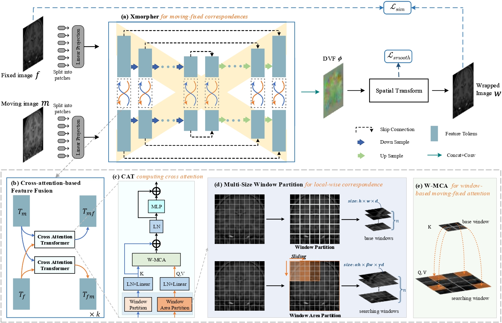
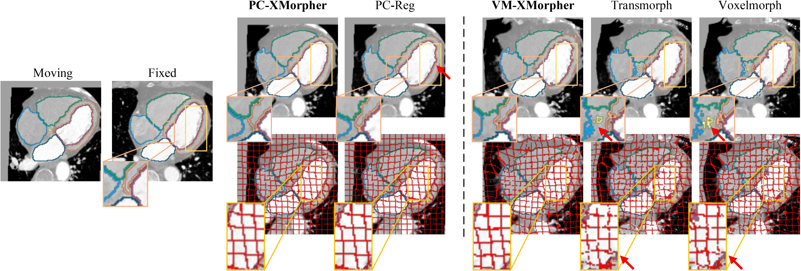

# XMorpher
--------------------------------------------------------------------------------


# Paper
Open source for MICCAI2022 paper: [XMorpher: Full Transformer for Deformable Medical Image Registration via Cross Attention]

# Citation
If you use this code or use our pre-trained weights for your research, please cite our papers:
```
@article{shi2022xmorpher,
  title={XMorpher: Full Transformer for Deformable Medical Image Registration via Cross Attention},
  author={Shi, Jiacheng and He, Yuting and Kong, Youyong and Coatrieux, Jean-Louis and Shu, Huazhong and Yang, Guanyu and Li, Shuo},
  journal={arXiv preprint arXiv:2206.07349},
  year={2022}
}
```


# Structure of XMorpher


# Available implementation
- MindSpore/
- Pytorch/


# Major results from our work

