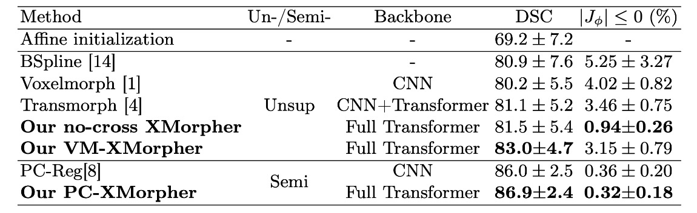

<p align="center"></p>

--------------------------------------------------------------------------------

Medical image registration is a typical two-image task which requires specialized feature representation networks for deep-learning-based methods (The existing methods and their limitations have been evaluated in our papers). Therefore, we designed a X-shape feature representation backbone which combines the relationship-aware capacity of Transformer and the traits of two-image tasks which foucus not only on structure information of each image but also on cross correspondence between the image pair. The overall structure of our network is following:

<p align="center"></p>

# Paper
This repository provides the official implementation of XMorpher and its application under two different strategies in the following paper:
<b>XMorpher: Full Transformer for Deformable Medical Image Registration via Cross Attention</b> <br/>
[Jiacheng Shi](https://github.com/Solemoon)<sup>1</sup>, [Yuting He](https://github.com/vatsal-sodha)<sup>1</sup>, Youyong Kong<sup>1,2,3</sup>,  <br/>
Jean-Louis Coatrieux<sup>1,2,3</sup>, Huazhong Shu<sup>1,2,3</sup>, Guanyu Yang<sup>1,2,3</sup>, and Shuo Li<sup>4</sup> <br/>
<sup>1 </sup>LIST, Key Laboratory of Computer Network and Information Integration (Southeast University), Ministry of Education, Nanjing, China <br/> 
<sup>2 </sup>Jiangsu Provincial Joint International Research Laboratory of Medical Information Processing <br/>
<sup>3 </sup>Centre de Recherche en Information Biomédicale Sino-Français (CRIBs) <br/>
<sup>4 </sup>Dept. of Medical Biophysics, University of Western Ontario, London, ON, Canada <br/>

<b>International Conference on Medical Image Computing and Computer Assisted Intervention (MICCAI), 2022</b> <br/>
[paper](https://arxiv.org/pdf/2206.07349.pdf) | [code](https://github.com/Solemoon/XMorpher) | [poster](https://pan.seu.edu.cn/#/preview/userdoc/石嘉诚/miccai-XMorpher/poster-475.pdf) | [video](https://pan.seu.edu.cn/#/media/userdoc/石嘉诚/miccai-XMorpher/video-475.mp4)

# Citation
If you use this code or use our pre-trained weights for your research, please cite our papers:
```
@article{shi2022xmorpher,
  title={XMorpher: Full Transformer for Deformable Medical Image Registration via Cross Attention},
  author={Shi, Jiacheng and He, Yuting and Kong, Youyong and Coatrieux, Jean-Louis and Shu, Huazhong and Yang, Guanyu and Li, Shuo},
  journal={arXiv preprint arXiv:2206.07349},
  year={2022}
}
```


# Available implementation
- MindSpore/
- Pytorch/

**&#9733; News: implemented under two training strategies [VoxelMorph](https://openaccess.thecvf.com/content_cvpr_2018/papers/Balakrishnan_An_Unsupervised_Learning_CVPR_2018_paper.pdf) and [PC-Reg](http://www.digitalimaginggroup.ca/members/Shuo/Few-shot_Learning_for_Deformable_Medical_Image_Registration_with_Perception-Correspondence_Decoupling_and_Rever[845].pdf). and the detailed corresponding main functions are Unsup-train.py and Semi-train.py respectively**


# Major results from our work
1. **XMorpher has the best DSC score and Jacobian score under both strategies**
<p align="center"></p>
2. **XMorpher has visual superiority on some detailed structures**
<p align="center"></p>


# Acknowledgement
This work was supported in part by the National Natural Science Foundation under grants (62171125, 61828101), CAAI-Huawei MindSpore Open Fund, CANN(Compute Architecture for Neural Networks), Ascend AI Processor, and Big Data Computing Center of Southeast University.
